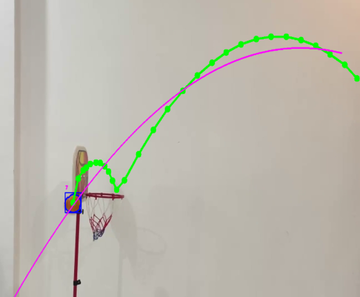

# 🏀 Basketball Shot Detector

A desktop application that detects and analyzes basketball shots from video input using computer vision techniques. The system tracks the ball based on color detection and predicts whether the shot is successful or not.

---

## 📌 Overview

This project uses OpenCV and color-based object detection to track a basketball in a video. By fitting a quadratic curve to the ball trajectory, the system predicts whether the ball passes through the hoop.

The application includes a simple GUI built with Tkinter to load and process videos.

---

## 🚀 Features

-  Detect basketball using HSV color filtering  
-  Track ball movement frame by frame  
-  Estimate trajectory using quadratic curve fitting  
-  Predict shot outcome (Basket / No Basket)  
-  Real-time score counting  
-  Simple GUI with video upload (Tkinter)  

---

## 🛠️ Technologies Used

- Python  
- OpenCV  
- NumPy  
- CvZone  
- Tkinter  
- PIL (Pillow)  

---


## ⚙️ Example of Basketball Goal Detection


## ⚙️ Installation

 Clone the repository:

```bash
git clone https://github.com/sedraosman/Basketball-Shot-Detector.git
cd Basketball-Shot-Detector
